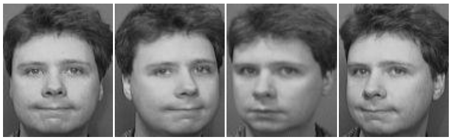
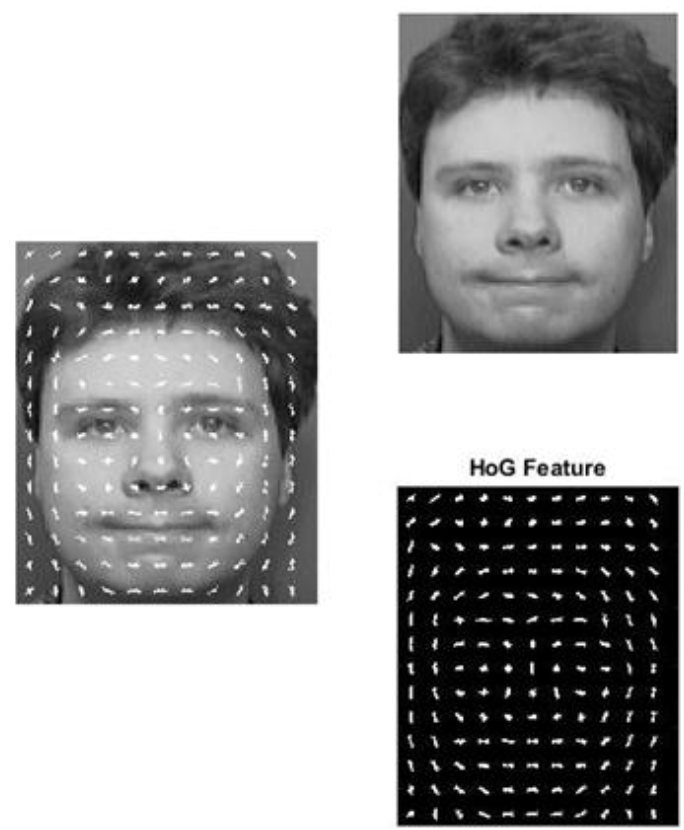
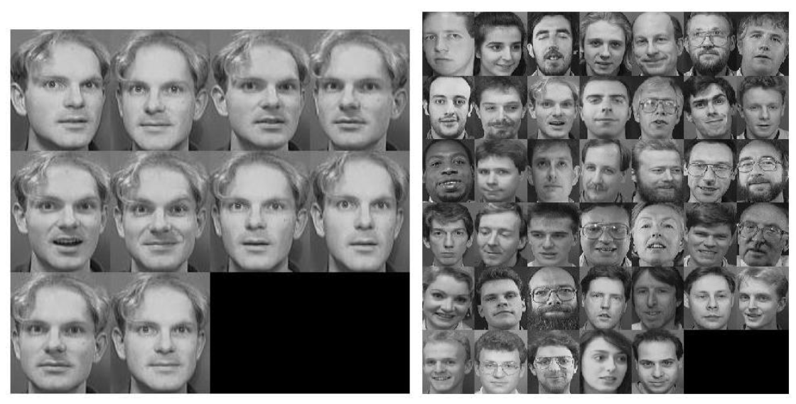
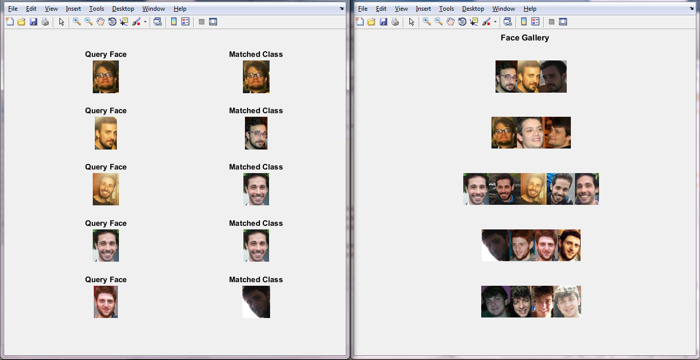

# HOG feature extraction
Estrazione delle HOG (Histogram of Oriented Gradients) features per il riconoscimento facciale in Matlab

## Riconoscimento facciale
Il riconoscimento facciale utilizza le caratteristiche fisiche del volto, configurandosi come una delle tecniche di riconoscimento personali tra quelle biometriche più note (iride, impronta, vocale, gait).
Si basa sull'analisi delle sembianze facciali dell'individuo, utilizzando immagini video in luce visibile o tecniche a infrarosso (queste ultime efficaci in assenza di luce).

Generalmente l’enrollment richiede pochi secondi, durante i quali vengono acquisite più immagini statiche del viso.

Le difficoltà del riconoscimento facciale è dovuto a tutto quello che oscura il volto: dalla presenza dei capelli all'oggettistica come gli occhiali, dalla posizione assunta dalla testa durante la ripresa, o ancora dall’illuminazione.

Molti sistemi, consentono di inquadrare l’utente da più angoli, ottenendo immagini di tipo tridimensionale. Il procedimento si fonda sull’estrazione, dal campione biometrico facciale, di un certo numero di tratti, quali la posizione degli occhi, del naso, delle narici, delle orecchie. La cooperazione dell’utente conduce ad un riconoscimento facciale molto accurato, così da poter essere utilizzato in funzione di controllo di accesso logico o fisico.

L’accettazione del riconoscimento biometrico basato sui tratti somatici da parte degli utenti è piuttosto alta, stante la natura non invasiva del metodo di acquisizione. I costi dei sensori, inoltre, sono bassi con riferimento a sistemi orientati all’accesso logico a personal computer, divenendo più elevati per i dispositivi più sofisticati, ad esempio per surveillance.

Occorre, tuttavia, considerare tra gli svantaggi che il riconoscimento facciale ha una bassa stabilità nel tempo, poiché i tratti del viso variano necessariamente sia con l’età che a causa di incideni o ferite. Un buon sistema, infatti, dovrebbe essere in grado di riconoscere una faccia da qualunque prospettiva ed in differenti ambienti esterni; tuttavia molte applicazioni presentano difficoltà ad identificare uno stesso volto a fronte di variazioni dell’illuminazione, inquadratura e background.

## Histogram of Gradiant (HoG feature)
Una delle tecniche utili al riconoscimento facciale consiste nell'estrazione delle HoG feature da un volto. Essa codifica i bordi di un oggetto, qui un volto, e la direzione di questi, risultando molto utile per rappresentare la struttura del soggetto indipendentemente da eventuali problemi di luce o problemi ambientali. Tali direzioni vengono sfruttate nelle fasi di matching. L’accuratezza di tali sistemi, inoltre, risulta spesso meno pregevole di quella propria di altre tecnologie biometriche, essendo essi influenzati anche dalle condizioni ambientali di illuminazione.
 

Una faccia possiede circa ottanta punti nodali, come la distanza intraoculare e la forma degli zigomi, molti dei quali sono suscettibili di essere misurati automaticamente per ricavare un codice rappresentativo, detto face print.
Il riconoscimento facciale risulta, pertanto, un metodo non intrusivo che verifica o identifica un individuo, confrontando la gallery di un database con le immagini digitali catturate in un ambiente controllato, o estratte da video in cui il soggetto è in movimento.

Un data-base sul riconoscimento facciale è necessario che sia abbastanza ricco: si consiglia, infatti, la disponibilità di più di una foto per soggetto, in quanto più foto sono presenti meno saranno le possibilità di incappare in un falso positivo.
Di ispirazione è stato il data-base di volti fornito dalla AT&T Laboratories Cambridge, contenente un set di volti di 40 distinti individui, con ciascuno 10 scatti presi in tempi, espressioni e luce diversa. Tutte le immagini sono scattate con uno sfondo scuro per mettere in risalto il volto.

## Implementazione

Il procedimento prevede generalmente quattro fasi:
1. la locazione del volto in un ambiente;
2. la normalizzazione, in termine di posizione e dimensioni;
3. la feature extracion, che dipende dall’algoritmo biometrico utilizzato per generare una rappresentazione numerica;
4. il riconoscimento, ottenuto mediante il confronto con uno o più template di riferimento.

## Esiti

